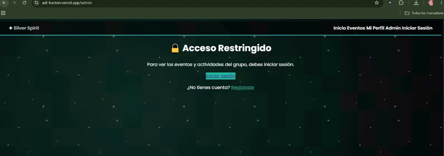
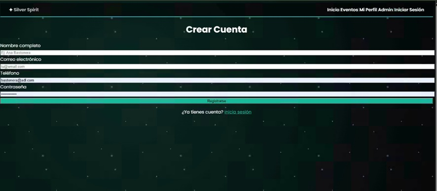
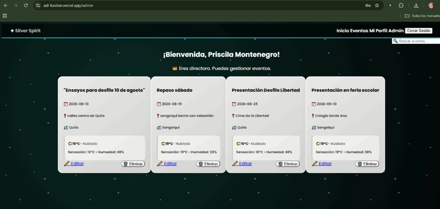

# Silver Spirit - Bastoneras

Sistema de gestión para el grupo de bastoneras **Silver Spirit**. Permite a la directora publicar y gestionar eventos, ensayos y presentaciones, mientras que las bastoneras pueden visualizar el calendario y consultar el clima de cada ubicación.

---

## Demo en vivo

[Ver video de defensa](https://ister-my.sharepoint.com/:v:/g/personal/priscila_montenegro_ister_edu_ec/IQC1vLQEX6TsSbzS8SCsuTgzAYMxdHANpXtOuq0wUIaj3BM?nav=eyJyZWZlcnJhbEluZm8iOnsicmVmZXJyYWxBcHAiOiJPbmVEcml2ZUZvckJ1c2luZXNzIiwicmVmZXJyYWxBcHBQbGF0Zm9ybSI6IldlYiIsInJlZmVycmFsTW9kZSI6InZpZXciLCJyZWZlcnJhbFZpZXciOiJNeUZpbGVzTGlua0NvcHkifX0&e=t2H6Zh)

---

## Capturas de pantalla

|  |  |  |

## Stack tecnológico

- **Next.js 14** (App Router)
- **TypeScript**
- **Tailwind CSS**
- **Supabase** (PostgreSQL + Autenticación)
- **Vercel** (Despliegue)
- **Open-Meteo API** (Clima en tiempo real)

---

## Roles de usuario

| Rol | Permisos |
| :--- | :--- |
| **Bastonera** | Visualizar eventos y calendario, buscar eventos por título, ubicación o ciudad, ver clima en tiempo real. |
| **Directora** | Todos los permisos de bastonera + crear, editar y eliminar eventos, acceso al panel de administración. |

---

## Modelo de datos

### Tablas en Supabase

1. **`profiles`** – Extiende `auth.users` con información adicional:
   - `id` (UUID, FK → auth.users)
   - `full_name` (text)
   - `phone` (text)
   - `emergency_contact` (text)
   - `uniform_size` (text)
   - `role` (text: `bastonera` o `directora`)

2. **`events`** – Eventos y ensayos del grupo:
   - `id` (UUID, PK)
   - `title` (text)
   - `description` (text)
   - `date` (date)
   - `location` (text)
   - `city` (text)
   - `created_by` (UUID, FK → profiles.id)

3. **`event_attendees`** – Asistencia a eventos:
   - `id` (UUID, PK)
   - `event_id` (UUID, FK → events.id)
   - `bastonera_id` (UUID, FK → profiles.id)
   - `status` (text: `confirmed` o `pending`)

### Relaciones

- Un usuario (directora) puede crear muchos eventos. (1:N)
- Una bastonera puede asistir a muchos eventos. (N:M)
- Un evento puede tener muchas bastoneras asistentes. (N:M)

---

## Instalación local

### Clonar el repositorio

```bash
git clone https://github.com/priscilapaolamh-lang/adl-baston.git
cd adl-baston